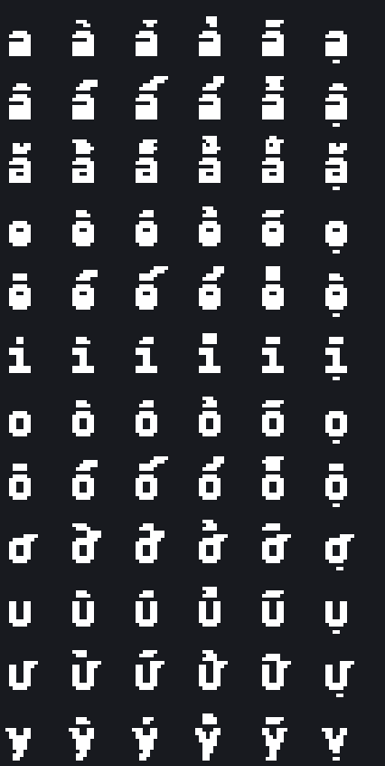

<div align="center">


# Divine Journey 2 — Việt hóa 2.23.4

**Bản dịch tiếng Việt cho modpack Divine Journey 2**, tập trung vào nhiệm vụ, hướng
dẫn và giao diện — phần chữ bạn thực sự phải đọc để chơi.

[](https://github.com/anhtahaylove/dj2-viethoa/releases/tag/v2.23.4)
[](#số-liệu-thật)
[](https://www.curseforge.com/minecraft/modpacks/divine-journey-2)

</div>

---

## Cài đặt trong 3 bước

**Bạn chỉ cần file này:** [`DJ2_Viet_Hoa_2.23.4_Client_Extract_To_Instance.zip`](https://github.com/anhtahaylove/dj2-viethoa/releases/tag/v2.23.4)

| Bước | Việc cần làm |
|:---:|---|
| **1** | Trong launcher, bấm chuột phải instance Divine Journey 2 → **Open Folder** |
| **2** | Giải nén file ZIP trên vào đúng thư mục đó, chọn **ghi đè** khi được hỏi |
| **3** | Vào game → **Options → Resource Packs** → bật gói **DJ2 Việt hóa** |

> **Không cần tạo thế giới mới.** Bản Việt hóa không đụng vào save của bạn.

<details>
<summary><b>Chơi trên máy chủ? Bấm vào đây</b></summary>

<br>

Chủ server dùng thêm `DJ2_Viet_Hoa_2.23.4_Server_Localization_Overlay.zip` để dịch
phần chữ do server gửi xuống (tin nhắn lệnh, tên nhiệm vụ trong chat). Người chơi
vẫn cài bản client như trên.

Chi tiết cài đặt và kiểm tra sau khi cài nằm trong
[ghi chú phát hành](release/DJ2_Viet_Hoa_2.23.4/GHI_CHU_PHAT_HANH.md).

</details>

---

## Bản này có gì

### Dịch những thứ bạn phải đọc

- **Toàn bộ nhiệm vụ BetterQuesting** — mô tả, mục tiêu, phần thưởng, giao diện.
- **Sách hướng dẫn** Patchouli, Tinkers' Construct, guide book các mod lớn.
- **Tooltip, thành tựu, tin nhắn** hiện trong lúc chơi.
- **Nhãn giao diện** của Astral Sorcery, EnderIO, Mekanism, Botania, ProjectE,
  Thermal, JEI, FTB Utilities, Quark và nhiều mod khác.

**35.519 dòng** đã dịch, trải trên **169 mod**.

### Giữ tên tiếng Anh — có chủ đích

Tên item, block, máy, mob, phép, nghi lễ và chòm sao **giữ nguyên tiếng Anh**.

Lý do rất thực tế: bạn gõ `Copper Ingot` vào JEI thì ra kết quả, gõ "Thỏi Đồng"
thì không. Mọi hướng dẫn, video và wiki về modpack này đều dùng tên tiếng Anh.
Dịch tên item nghe thì hay, nhưng làm bạn không tra cứu được gì nữa.

### Sửa một lỗi của chính modpack

Bản này kèm bản vá cho một lỗi **có sẵn trong Divine Journey 2**, không liên quan
đến việc dịch: **27 loại quặng** Copper, Tin, Nickel và Aluminum sinh ra trong đá
của Underground Biomes (granite, andesite, limestone…) **không nung được trong lò**.

<div align="center">

| Kim loại | Số biến thể đá | Trạng thái |
|---|:---:|:---:|
| Copper | 9 | ✅ Đã sửa |
| Tin | 6 | ✅ Đã sửa |
| Nickel | 6 | ✅ Đã sửa |
| Aluminum | 6 | ✅ Đã sửa |

</div>

Nguyên nhân: Underground Biomes tạo bản sao quặng theo từng loại đá và hỏi lò
"quặng gốc nung ra gì?" — nhưng hỏi *trước khi* Thermal Foundation kịp đăng ký
công thức nung, nên nhận về con số không. Máy nghiền và lò hồ quang không dính lỗi
này vì chúng tra theo ore dictionary. Bản vá đăng ký lại đúng 27 công thức lúc
server khởi động.

---

## Chất lượng hiển thị

Font mặc định của Minecraft không có dấu tiếng Việt. Gói này kèm font đã dựng lại
để dấu hiện đúng, không bị cắt hay chồng lên nhau:

<div align="center">

</div>

---

## Số liệu thật

<div align="center">

| | |
|---|---|
| Phạm vi dịch | **84,1%** (22.783 / 27.075 khóa trong phạm vi) |
| Dòng đã ship | 35.519 dòng, 169 mod |
| Nợ dịch ưu tiên cao (T1) | **0** |
| Còn lại | 270 nhãn giao diện phụ, 189 màn hình cấu hình, 547 chuỗi lẻ |
| pytest | **212 passed**, 2 subtests |
| Gate build / EOL / verify | tất cả exit 0 |

</div>

Phần chưa dịch là màn hình cấu hình, công cụ quản trị và chuỗi lẻ ít gặp — không
phải nội dung bạn đọc khi chơi. Thêm **3.286 dòng** cố ý để nguyên tiếng Anh vì
chúng là tên tra cứu được, và **561 dòng** tài liệu chỉ dành cho lập trình viên.

---

## Dành cho người muốn tự build

<details>
<summary><b>Cấu trúc kho và quy trình build</b></summary>

<br>

```
source/            bản dịch gốc, là nguồn sự thật duy nhất
  server_shared/   script CraftTweaker dùng chung cho client và server
work/              công cụ đo đạc, phân tier, báo cáo
tools/             validator, builder, gate kiểm tra
release/           artifact đã đóng gói + checksum
docs/              ảnh minh họa
```

Build lại toàn bộ:

```bash
python tools/build_release_chain.py
```

Chuỗi này chạy validator, dựng ba ZIP, tính SHA-256 và kiểm tra từng file trong
artifact có khớp `source/` không. Bất kỳ file nguồn nào không tới được artifact
sẽ làm build **fail** — không có ngoại lệ ngầm.

**Nguyên tắc kiểm tra:** thiếu dữ liệu để kiểm thì gate phải *fail*, không được
coi "không tìm thấy lỗi" là "không có lỗi".

</details>

<details>
<summary><b>Quy tắc dịch</b></summary>

<br>

Bốn quy tắc quyết định một chuỗi được dịch hay giữ tiếng Anh:

1. **Tên tra cứu được thì giữ tiếng Anh.** Item, block, máy, chất lỏng, nâng cấp,
   mod, tên riêng — để người chơi còn gõ được vào JEI và wiki.
2. **Khuôn sinh tên thì giữ tiếng Anh.** Chuỗi như `%s Bolt`, `%s Ingot`,
   `Block of %s` là khuôn ghép tên registry, không phải nhãn giao diện.
3. **Câu cho người đọc thì dịch.** Tooltip, mô tả nhiệm vụ, hướng dẫn, thông báo.
4. **Thứ người chơi phải gõ thì giữ nguyên.** Cú pháp lệnh, tên tham số, key config.

Ràng buộc kỹ thuật bắt buộc: giữ đúng thứ tự và số lượng token `%s`/`%d`/`%n`,
giữ nguyên mã màu `§`, giữ nguyên URL, không tạo `%` trần, không xuống dòng thật
trong giá trị, mã hóa UTF-8.

</details>

<details>
<summary><b>Những lỗi các gate đã bắt được</b></summary>

<br>

Ghi lại vì mỗi lỗi đều sinh ra một gate mới:

- **Khuôn tên item bị dịch** — `base.part.bolt` của GregTech là khuôn `%s Bolt`;
  dịch nó làm hỏng hàng loạt tên trong JEI.
- **Key tự bịa** — một lần sửa xung đột đã tạo key không tồn tại trong JAR. Từ đó
  mọi thay đổi phải thỏa `set(vi) ⊆ set(source)`.
- **Dịch từng ký tự** — 16 key animation của ProjectE bị dịch theo từng chữ cái.
- **Sai bậc đơn vị** — `Quintillion` (10¹⁸) bị dịch thành "Tỷ tỷ" trong khi chuỗi
  trước đó là 10¹⁵ "Triệu tỷ"; giá trị đúng là "Nghìn triệu tỷ".
- **Nguồn English bị nhiễm tiếng Việt** — 7.014 khóa trong
  `work/runtime_locale_sources/` chứa bản dịch thay vì English gốc. Vì mọi
  validator đều so `source` với `translated`, chúng báo "sạch" trong khi lỗi vẫn
  còn. Bài học: **kiểm chính nguồn sự thật trước khi tin kết quả kiểm.**
- **Gate kiểm sai file** — `check_readme_numbers.py` kiểm `DOC_DAU_TIEN.md` chứ
  không phải `README.md`, nên README giữ số liệu lỗi thời qua nhiều wave mà không
  gate nào báo.

</details>

<details>
<summary><b>Kiểm tra tính toàn vẹn</b></summary>

<br>

Mỗi bản phát hành đều kèm `SHA256SUMS.txt`. Kiểm tra sau khi tải:

```bash
sha256sum -c SHA256SUMS.txt
```

Bản v2.23.4 đã được tải ẩn danh từ GitHub Release và xác minh checksum khớp,
đồng thời xác nhận script vá 27 quặng có mặt trong gói.

</details>

---

<div align="center">

**Việt hóa bởi huuhungn** · Modpack gốc: [Divine Journey 2](https://www.curseforge.com/minecraft/modpacks/divine-journey-2)

Bản dịch này là dự án của người hâm mộ, không liên kết với tác giả modpack.

</div>
